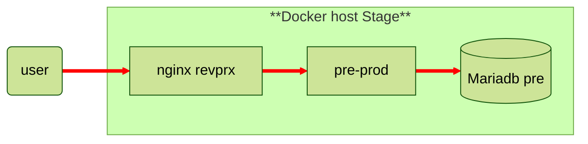
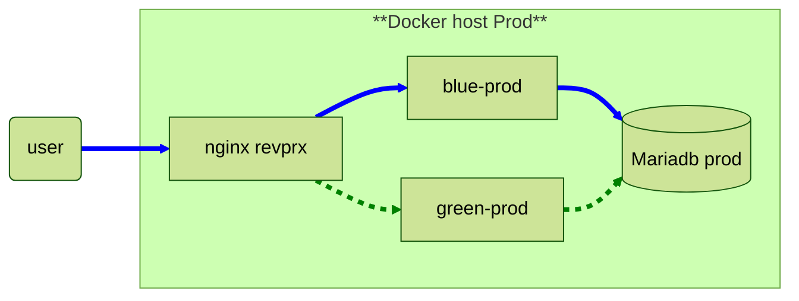
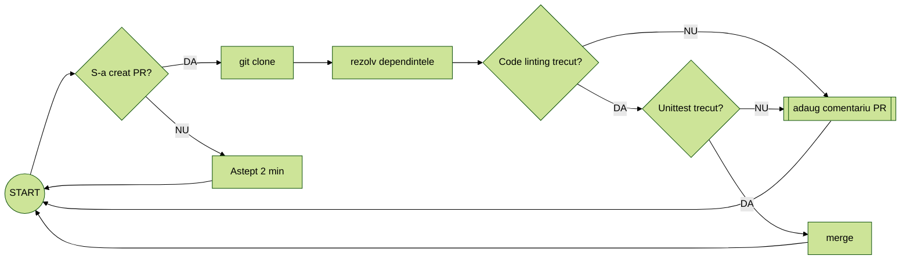

## Python prereq

```bash
python3 -m venv venv
source venv/bin/activate
pip install django mysqlclient python-dotenv

python manage.py runserver

deactivate

```

```bash
django-admin startproject loc_biblioteca .
python manage.py startapp biblioteca


docker exec -it web python manage.py createsuperuser
```

```sql
create database biblioteca;
CREATE USER 'bibliotecar'@'%' IDENTIFIED BY 'passsecr';
GRANT ALL PRIVILEGES ON biblioteca.* TO 'bibliotecar'@'%';

GRANT ALL PRIVILEGES ON `test_%`.* TO 'bibliotecar'@'%';
FLUSH PRIVILEGES;
```

## teste

#### Code linting

```bash
pip install flake8 ruff
```

```bash
flake8 . --exclude=venv
```

```bash
ruff check .
ruff check . --fix
```

#### Unit testing

* teste 5

#### Diagrama





## CI Pipeline




